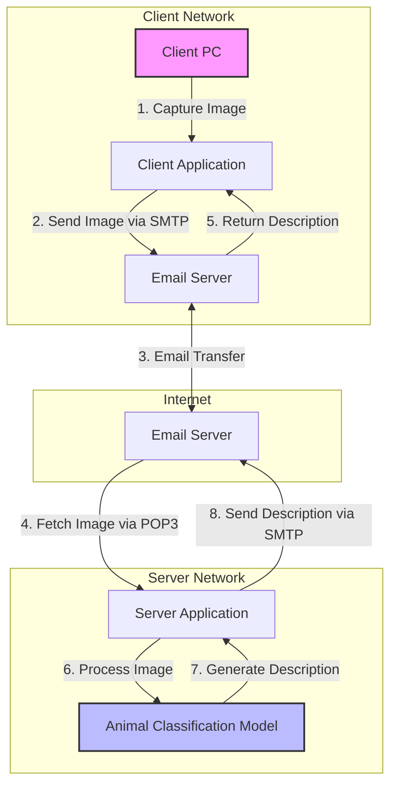
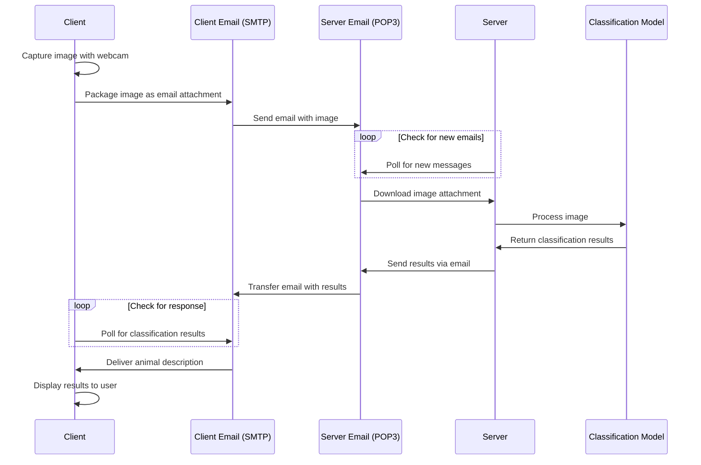
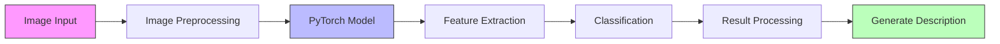
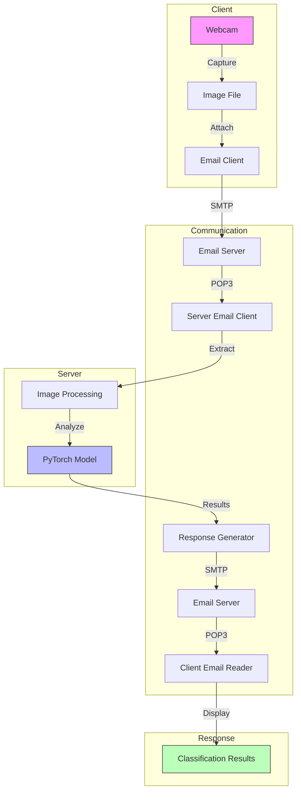
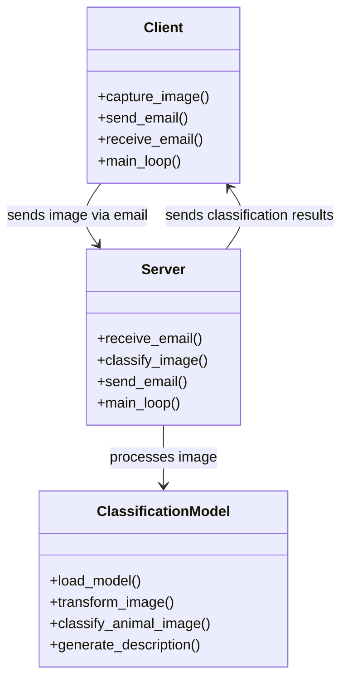
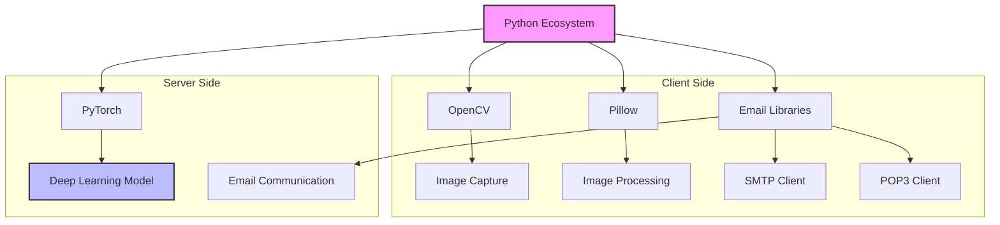

# Image Description Generation Using Client-Server Connection with Different Networks

## Project Overview
This project implements a distributed system for animal image classification across different networks using standard email protocols (SMTP and POP3) for communication. The system consists of a client that captures images and sends them to a server, which then processes the images using a pre-trained deep learning model to classify animals and generate detailed descriptions. The classification results are sent back to the client, creating a complete automated pipeline.

## Table of Contents
- [Architecture](#architecture)
- [System Workflow](#system-workflow)
- [Components](#components)
- [How It Works](#how-it-works)
- [Setup Instructions](#setup-instructions)
- [Features](#features)
- [Technologies Used](#technologies-used)
- [Future Work](#future-work)
- [Contributors](#contributors)

## Architecture

The system follows a client-server architecture where communication happens across different networks through email protocols.

### System Architecture Diagram



## System Workflow

### Detailed Process Flow



### Classification Pipeline



## Components

### Client Side (PC 1)
- Captures images using a webcam or selects existing images
- Packages and sends images via SMTP to a predefined email address
- Periodically checks for response emails containing classification results
- Displays the received animal descriptions to the user

### Server Side (PC 2)
- Continuously monitors a designated email inbox using POP3
- Downloads image attachments from received emails
- Processes images using a pre-trained PyTorch animal classification model
- Generates detailed descriptions including scientific name, common name, characteristics, and habitat
- Sends classification results back to the client via email

### Classification Model
- Pre-trained PyTorch deep learning model for animal classification
- Returns comprehensive information including:
  - Scientific name
  - Common name
  - Description
  - Habitat
  - Conservation status (endangered)
  - Safety information (dangerous/poisonous/venomous)
  - Classification confidence (probability)

### Data Flow Diagram



## How It Works

1. **Image Acquisition**:
   - The client application activates the webcam and captures an image
   - The image is temporarily saved on the client system

2. **Image Transmission**:
   - The client packages the image as an email attachment
   - Email is sent using SMTP protocol to a predefined server email address
   - The email subject includes a timestamp for tracking purposes

3. **Server Processing**:
   - The server continuously checks the designated email inbox using POP3
   - When an email with an image attachment is found, the server downloads it
   - The image is processed through the animal classification model

4. **Classification**:
   - The PyTorch model analyzes the image and classifies the animal
   - A complete description is generated with multiple attributes
   - If the confidence level is below 20%, the system returns "Could not identify"

5. **Result Transmission**:
   - The server packages the classification results in a plain text email
   - The response is sent back to the client's email address

6. **Result Display**:
   - The client checks for and retrieves the response email
   - The classification results are displayed to the user

### Classification Example

When an image of a tiger is sent through the system, the result might look like:

```json
{
  "scientific_name": "panthera-tigris",
  "common_name": "Tiger",
  "description": "The largest of the big cats, recognized by its orange coat with black stripes.",
  "habitat": "Forests, grasslands, and wetlands across Asia",
  "endangered": "endangered",
  "dangerous": "True",
  "poisonous": "False",
  "venomous": "False",
  "probability": 97.79
}
```

## Setup Instructions

### Prerequisites
- Python 3.x
- PyTorch and torchvision
- OpenCV (cv2)
- Pillow (PIL)
- Email accounts for client and server (Gmail recommended)
- App passwords for email accounts (for secure authorization)

### Installation Steps

1. Clone the repository:
   ```
   git clone https://github.com/yourusername/image-description-generation.git
   cd image-description-generation
   ```

2. Install required dependencies:
   ```
   pip install torch torchvision pillow opencv-python
   ```

3. Set up email credentials:
   - Create two separate Gmail accounts (one for client, one for server)
   - Enable 2-Factor Authentication and generate App Passwords for each
   - Update the email credentials in both `client.py` and `server.py`

4. Download model files:
   - Ensure `animal_image.pth` (model) is available
   - Ensure `animal_image_checkpoint.pth.tar` (checkpoint) is available
   - Ensure `animal_image.json` (classification data) is available

5. Running the system:
   - Start the server on PC 2:
     ```
     python server.py
     ```
   - Start the client on PC 1:
     ```
     python client.py
     ```

### System Structure



## Features

- **Cross-Network Communication**: Works across different networks without direct connection
- **Real-time Image Classification**: Provides detailed animal descriptions with high accuracy
- **Automated Pipeline**: Fully autonomous system requiring minimal user intervention
- **Universal Accessibility**: Works anywhere with basic internet connectivity
- **Webcam Integration**: Direct image capture through connected camera
- **Comprehensive Classification**: Provides detailed information about identified animals

## Technologies Used

- **Python**: Core programming language
- **PyTorch**: Deep learning framework for image classification
- **OpenCV**: Computer vision library for image capture and processing
- **SMTP/POP3**: Email protocols for cross-network communication
- **PIL (Pillow)**: Python Imaging Library for image handling
- **Gmail**: Email service for message exchange

### Technology Stack Diagram



## Future Work

- Add encryption and security layers to the data transfer
- Implement more complex models like object detection or scene understanding
- Support multiple clients for collaborative classification systems
- Develop a user interface (UI) to track communication logs and outputs in real-time
- Optimize for better performance and lower latency
- Integrate with cloud services for enhanced scalability

## Contributors
- Prithwish Dey (CSE/22065/919)
- Amit Mandhana (CSE/22014/868)
- Anindya Bhaumik (CSE/22018/872)
- Aditya Paul (CSE/22004/858)
- Chirag Shukla (CSE/22038/892)
- Adrish Roy (CSE/22007/861)
- Akash Chauhan (CSE/22009/863)

## License
This project is licensed under the MIT License - see the LICENSE file for details.
